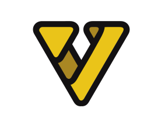

  
   
  <b>A programming language for Vietnameses</b>
   
   
  
  

## What is VNC ?
VNC is a scripting/programming language created for Vietnamese with syntax which specifies Vietnamese. This language was built based on the source code of another language which I also made called <a href="https://github.com/nguyenphuminh/FreakC">"FreakC"</a>

<a href="README-vi.md">Chuyển sang tiếng Việt...</a>

## Compiler's usage
In the "VNC" folder, open cmd and type this command to compile and run the code:

    vnc file_name
    
Example:
    
    vnc Examples/HelloWorld.vnc
 
If you want to compile the code only, type:

    vnc file_name --dich
    
If you want to compile the code and show the compiled code, type:

    vnc file_name --dichvadoc
    
To show the current version of the devkit, type:

    vnc --phienban

To create a new VNC project quickly, you can type:

    vnc project_name --tao

<b>The compiler only works on Windows, and can only be compiled to Batch.</b>

## Samples
<a href=https://github.com/nguyenphuminh/VNC/tree/master/Examples>Click here to see samples</a>

## Convert VNC to .EXE files
In "vnc/utils/scripts" there is a file called battoexe.bat which helps to convert .bat files to .exe files.

So to convert VNC to .EXE files, you need to compile VNC codes to Batch first, and then convert the Batch file generated by simply dragging that Batch file onto battoexe.bat.

You can actually find plenty of other tools online that helps you to converts Batch files to EXE files.

## Sublime Text
For syntax highlighting, copy the "VNC" folder in the same folder, then paste it in "%APPDATA%\Sublime Text v\Packages\".

Sublime Text is highly supported for VNC, so you definitely should use Sublime Text if you want to start VNC development.

## Frameworks
There are many frameworks in the utils folder that you can use, I will definitely update the usage of them soon.

<b>Note: I don't own those frameworks.</b>

## Copyrights and License
Copyright © 2020 Nguyen Phu Minh

This language is licensed under the MIT License